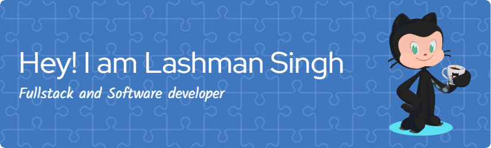

<h1 align="center">
  
  Hi, I'm Lashman Singh
</h1>

<h3 align="center">
  🖥️ Skilled Full Stack and Software Developer with expertise in web and application design and development, delivering high-quality results.
</h3>

  
  

### 👨‍💻 About Me:
- 🔭 I’m currently working on **Airbnb clone**
- 🌱 I’m currently learning **MERN Stack, Web, and App Development**
- 👯 I’m looking to collaborate on **New Projects**
- 👨‍💻 Check out my portfolio at [My Portfolio](https://e-portfolio-gules-kappa.vercel.app/)
- 💬 Ask me about **Software and Web Development**
- 📫 Reach me at **lashmansingh38034@gmail.com**
- ⚡ Fun fact: **I'm a singer and musician! 🎶**

---

<h3 align="left">🔗 Connect with me:</h3>

  

---

### 💻 Languages and Tools:

   
   
   
   
   
   
  
   
   
   
   
   
   
   
   
   
   
   
   
   
   
   
   
   
   
   
   

---

### 📊 GitHub Stats:

  
  
  

---

### ✨ Fun Animated Banner:

  

